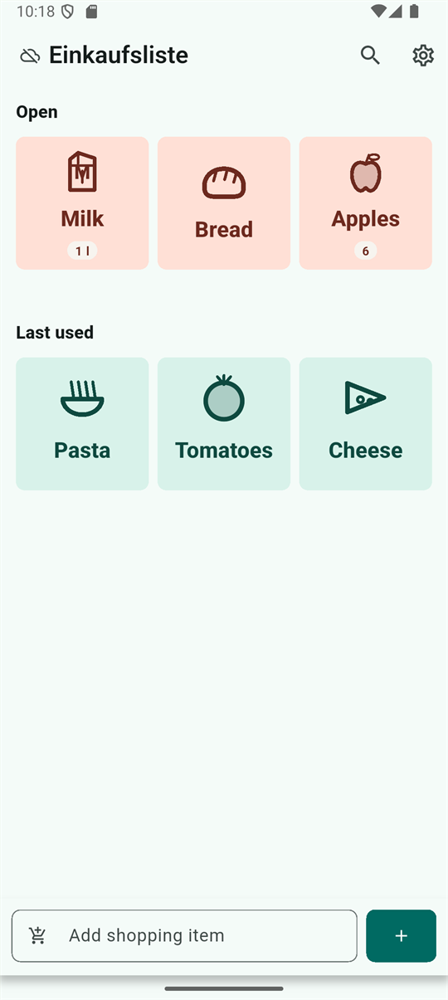
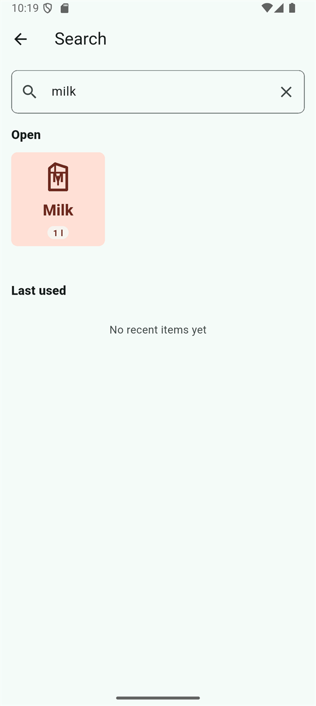
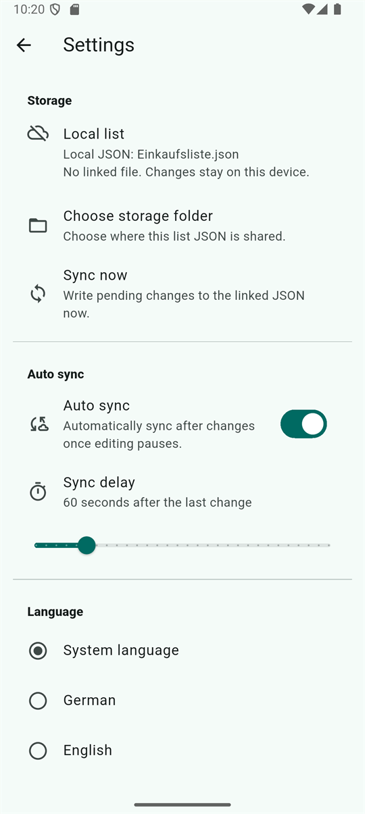
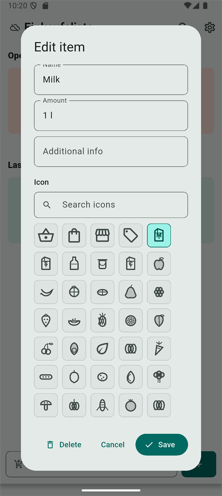

# nextcloud-shopping-app

A Flutter-based Android shopping list app for simple shared lists. The app keeps
one JSON file per shopping list and can link each list to a folder exposed
through Android's system document picker, for example by Nextcloud, Google
Drive, Dropbox, or another Android document provider.

The app is currently built and tested as an Android app. The main branch is
`main`. The current developer release version is `1.1.0+3`.

## Screenshots

| Shopping list | Search |
| --- | --- |
|  |  |

| Settings | Icon picker |
| --- | --- |
|  |  |

## Current Features

- Flutter Android app with portrait-only orientation.
- German and English UI with language selection in settings.
- Light and dark theme following the Android system setting.
- Multiple named shopping lists.
- One local JSON file per list in the app's private Android storage.
- Optional shared storage folder per list through Android's Storage Access
  Framework.
- Linked storage management in a dedicated settings screen.
- Compact sync status icon next to the active list name instead of a full status
  strip on the list screen.
- Automatic shared JSON handling:
  - if `<list name>.json` exists in the selected folder, it is loaded and used
    as the active list;
  - if it does not exist, the current local list is written into that folder.
- Persistent Android URI permissions for later writes to the linked JSON file.
- Debounced auto sync after item changes. The default delay is 60 seconds after
  the last change and can be adjusted in settings.
- Pending changes are also flushed when the app is paused or sent to the
  background.
- Manual "sync now" and "reload from file" actions in settings.
- Nextcloud-compatible fallback for providers that do not support direct file
  creation through `DocumentsContract.createDocument`.
- Open and last-used item sections.
- Items are grouped by store within each section.
- Three square item tiles per row.
- Warm red tiles for open items and green/turquoise tiles for last-used items.
- Tap an item to move it between open and last-used.
- Drag an item by its handle to reorder it or move it into another store
  section.
- Long-press an item to edit name, amount, store, and icon.
- Store autocomplete in the item editor based on stores already used in the
  active list.
- Searchable manual icon picker in the item edit dialog.
- Bottom input field for adding items.
- Search-as-you-type suggestions from the last-used section.
- Full-text list search through the search icon in the app bar.
- Expanded built-in pictogram catalog with flexible keyword-based icon
  assignment for plurals and common German inflections.
- Localized icon picker search for German and English.
- Supermarket-style default ordering for newly added open items.
- Larger tile pictograms, larger tile text, wrapping, and dynamic text fitting
  for longer item names.
- Custom drawn vector pictograms for common groceries such as milk, juice, rice,
  flour, bread, fruit, vegetables, snacks, jars, cans, dry goods, soft drinks,
  dairy packages, and dental care items.
- Deterministic generated fallback icons with selectable variants for unmatched
  items.

## App Workflow

Use the list title in the app bar to:

- switch between lists;
- create a new list;
- rename the active list.

The icon next to the list name shows the sync state:

- cloud off: local-only list;
- cloud done: linked and synced;
- cloud queue: linked with pending local changes;
- cloud sync: currently syncing;
- cloud off/error color: sync error.

Use the search icon in the app bar to open full-text search across item name,
amount, store, and icon key.

Open and last-used items are grouped by store. New open items are placed in a
simple supermarket-style default order by product category. Use the small drag
handle on a tile to move it within the list; dropping an item into another store
section updates its store value automatically. Long-press still opens item
editing.

Use the settings icon to open the dedicated settings screen. The settings screen
contains language settings, storage status, folder selection, manual sync,
reload from file, unlink storage, and auto-sync configuration.

By default, lists are local only. The settings screen shows the local JSON file
name until a shared folder has been linked. After linking, it shows the linked
storage location.

## Shared Folder Behavior

Each list is stored as a separate JSON file. The file name is derived from the
list name:

```text
Ottokar Shopping.json
```

When a shared folder is selected:

1. The app looks for a JSON file with the active list name.
2. If the file exists, the app reads it and replaces the local copy of that
   list with the shared content.
3. If the file does not exist, the app writes the current local list into the
   selected folder.
4. Later item changes are saved locally immediately.
5. Linked lists are written back to the shared JSON after the configured
   auto-sync delay or when manual sync is triggered.

When using Nextcloud, Android may show an additional "create document" flow if
the Nextcloud document provider refuses direct file creation. Confirm the
suggested file name in the same folder. The app then searches the selected
folder again and stores the resulting document URI.

Renaming a linked list creates or switches to the JSON file matching the new
list name. Old shared JSON files are not deleted automatically.

## Sync Behavior

The app intentionally separates local saving from shared-file syncing. Every
item change is written to the local app storage first. If the list has a linked
shared JSON file, the app schedules an auto sync after a quiet period. The
default quiet period is 60 seconds and can be changed in settings.

This avoids writing to Nextcloud or another provider after every small edit,
while still reducing the risk of forgotten manual syncs. The app also tries to
flush pending changes when Android pauses the app, for example when the display
turns off or the user switches away.

If auto sync is disabled, the user can still use "sync now" in settings.

## JSON Schema

The app writes each list in this shape:

```json
{
  "schemaVersion": 1,
  "updatedAt": "2026-06-16T20:00:00.000Z",
  "items": [
    {
      "id": "milk",
      "name": "Milk",
      "amount": "1 l",
      "note": "Supermarket",
      "icon": "milk",
      "order": 0,
      "state": "open"
    }
  ]
}
```

`state` is either `open` or `lastUsed`. The `note` field is used by the current
app version as the store name so existing shared JSON files remain compatible.

The app also keeps a private local manifest with list names, the active list,
local file names, and optional linked-folder metadata. That manifest is not part
of the shared JSON list format.

## Development

Run the static analyzer:

```powershell
flutter analyze
```

Run tests:

```powershell
flutter test
```

Build a debug APK:

```powershell
flutter build apk --debug
```

The debug APK is written to:

```text
build/app/outputs/flutter-apk/app-debug.apk
```

Build an installable developer release APK:

```powershell
flutter build apk --release
```

The release APK is written to:

```text
build/app/outputs/flutter-apk/app-release.apk
```

Install the debug APK on a connected Android phone:

```powershell
adb install -r build\app\outputs\flutter-apk\app-debug.apk
```

If `adb` is not in `PATH`, use the Android SDK path directly:

```powershell
& "$env:LOCALAPPDATA\Android\Sdk\platform-tools\adb.exe" install -r build\app\outputs\flutter-apk\app-debug.apk
```

Install the release APK directly:

```powershell
& "$env:LOCALAPPDATA\Android\Sdk\platform-tools\adb.exe" install -r build\app\outputs\flutter-apk\app-release.apk
```

## Releases

Release notes are maintained in [CHANGELOG.md](CHANGELOG.md). The release
process is documented in [docs/release.md](docs/release.md).

Tagged versions matching `v*`, for example `v1.1.0`, trigger the Android release
workflow in GitHub Actions. The workflow validates the app, builds
`app-release.apk`, and attaches a named APK to the GitHub Release.

The current APK is a developer/testing release signed with the debug signing
key. Configure a real Android release keystore before publishing to an app
store.

## Current Validation

The current implementation has been checked with:

- `flutter analyze`
- `flutter test`
- `flutter build apk --debug`
- `flutter build apk --release`
- installation on a Moto G84 5G through USB debugging

## Known Open Points

- True AI image generation/regeneration is not implemented yet; it will require
  an AI service or local image-generation backend.
- Custom icon files are not stored next to the shared JSON yet. Current custom
  pictograms are app-native vector drawings, plus deterministic generated
  fallback variants.
- Conflict handling is simple last-write-wins behavior. There is no merge UI for
  simultaneous edits from multiple users yet.
